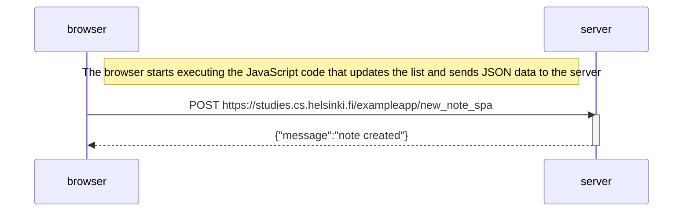

```mermaid
sequenceDiagram
    participant browser
    participant server

    Note right of browser: The browser starts executing the JavaScript code that updates the list and sends JSON data to the server

    browser->>server: POST https://studies.cs.helsinki.fi/exampleapp/new_note_spa
    activate server
    server-->>browser: {"message":"note created"}
    deactivate server


   
```
